# Project Nextflow microcredential

## Introduction 

In this project, I developed a workflow designed to identify significant associations between genetic variants/genes and a specific phenotype, disease, or condition. The analysis requires two inputs: a phenotype file and a pVCF (project VCF) file. In the initial steps, the pVCF is preprocessed and filtered to retain relevant variants. The workflow performs single-variant testing. Normally, gene-based testing is performed as well. Common variants, with a minor allele frequency (MAF) of at least 0.01, allow to be tested individually, as the alternative allele is frequent enough to allow for a powerful statistical analysis. Rare and very rare variants, with a MAF below 0.01, do not allow for a single variant analysis due to the lack of statistical power. For these latter variants, the cumulative effect of multiple variants within a single gene is tested, under a wide range of assumptions. Finally, a report is created with the results. 

The workflow includes 4 modules: 
1. QC_preprocessing_VCF
2. variant_filtering
3. variant_testing
4. report_results



*FYI: This analysis was part of a study aimed at identifying disease-associated variants in the SMARCA4 gene related to otosclerosis. A single-molecule Molecular Inversion Probe (smMIP) experiment was designed to capture and sequence the DNA of the SMARCA4 gene in both otosclerosis case and control samples. However, in this example a random test dataset from the 1000Genomes project was used. Two random subsets were created from `ALL.chrMT.phase3_callmom-v0_4.20130502.genotypes.vcf` file [link](https://ftp.1000genomes.ebi.ac.uk/vol1/ftp/release/20130502/). The phenotype information was also created by random sampling phenotype of 0/1. Thus, the results have no meaning at all.*

Instruction to run the nextflow pipeline on the VSC:
```
nextflow run main.nf -profile standard,apptainer
```
Also, a docker profile was included in the nextflow.config. 

## Modules 

### 1. Quality control preprocessing 
During the quality control step, multiallelic variants are separated into individual lines using bcftools.

*Note: While a full quality control pipeline typically includes additional steps—such as left normalization—these were omitted due to time constraints and to minimize the test data size.*

### 2. Variant filtering 
All monomorphic variants are removed from the pVCF, as they do not contribute to distinguishing between cases and controls. Including such variants would only increase the burden of multiple testing without adding meaningful information.

*Note: Additional filtering steps—such as excluding variants that deviate from Hardy-Weinberg equilibrium—are typically part of variant filtering. However, these were omitted here due to time constraints.* 

### 3. Association test 
A subworkflow was developed consisting of two processes: dataset formatting and single-variant testing.
The `formatting.r` script takes the preprocessed and filtered VCF file along with the corresponding phenotype file. It generates a genotype matrix in the appropriate format—0 (homozygous reference), 1 (heterozygous), and 2 (homozygous alternate). The phenotype data is then reordered to align with the sample order in the genotype matrix.

The `single_variant_test.r` script performs a Fisher exact test on all variants with a MAF >= 0.01. 

*FYI:The `gene_based_test.r` script performs three types of gene-based association tests: the burden test, the variance component test, and SKAT-O. These tests are applied because the underlying distribution of variant effects is unknown. Depending on this distribution, one test may offer greater statistical power than the others for detecting gene-phenotype associations. By running all three, the analysis remains robust across a range of possible genetic architectures.*
**The Gene-based testing took a long time to run, and was for efficiency removed from the workflow**

*Note: There are several reproducibility concerns associated with this analysis. The single-variant testing was implemented manually to better understand each step of the single variant test. However, in standard practice, tools such as PLINK are typically used to perform Fisher's exact tests for assessing associations involving common variants. This will introduce fewer complications.*

### 4. Reporting results
In the final step, all results are collected and reported in a single output file.

## Workflow 

The parameters are included in `params.config`. The parameters include the paths of the input data files and the output directory. 

In the nextflow.config, profiles were added for apptainer and docker. Additionally, a standard profile was included to provide the correct resources for each process. *Note: this can be expanded and optimized in the future. At the moment, it doesn't add much value as all processes utilize the same resources*

The workflow begins by collecting all VCF files into a queue channel. Each file is mapped into a tuple containing the file's base name and its path. The base name is included to track the file through the pipeline, with each processing step appending a new extension to the name to indicate which transformations have been applied.

First, the files go through the `multiallelic_splitting`process from the QC_preprocessing_vcf module. The output files with a new extension are passed on to the next process `monomorphic` from the variant_filtering module. Again, a tuple of the file basename and file path is set as input. The set operator sets the tuples to a new channel called input_vcf_monomorph. 

A new queue channel is created for the phenotype files for association testing. The phenotype files are matched with the corresponding vcf file for association testing. All results are then collected and included in a report.

## Possible improvements 

In the future, I would adapt the pipeline to include all necessary modules for the analysis. I would further optimize the computing resources for each module and include a shell script for SLURM. The R scripts would either be improved for reproducibility or other tools such as PLINK/regenie can be implemented in new modules. I would also make the workflow conda compatible, by adding conda compatibility in the nextflow config and including conda packages for each process for example: bioconda::bcftools. I would also report the results in a better manner/format (now all content is just appended to a text file without any structure). 

## Difficulties with the assignment 

Due to recurring problems with the Tier-1 of the University of Antwerp, I continued my work on the BIOMINA server. At which everything went fine. However, I wasn't able to check the Docker compatibility due to sudo right restrictions. 